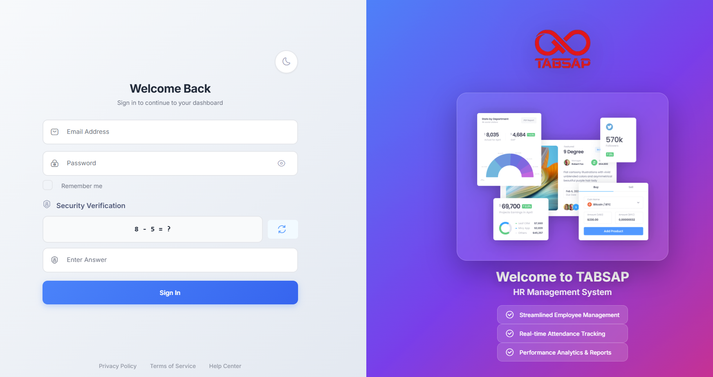
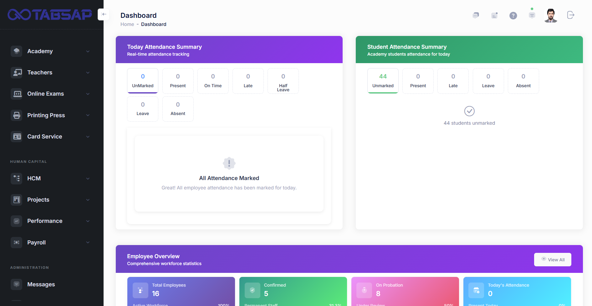

# 👥 HRM System — Human Resource Management Platform

> End-to-end Human Resource Management platform — employee records, attendance, payroll, leave management, and recruitment — for SMEs and enterprise teams.

🔗 **Live:** https://hrm.tabsap.com/
🔒 **Application:** Login-protected (HR + employee portals)
🏢 **Built at:** Tabsap
📅 **Period:** 2024 — 2025
📂 **Status:** Production · Active

---

## 🎯 What it does

The HRM System is a complete HR operations platform that replaces fragmented spreadsheets, paper forms, and standalone payroll tools with one unified system. It covers the full employee lifecycle:

- Employee records and document management
- Attendance tracking (manual + integrations with biometric devices)
- Leave application, approval, and balance tracking
- Payroll calculation including allowances, deductions, and end-of-service
- Recruitment pipeline (vacancies, applicants, hiring stages)
- Role-based access for HR, managers, and individual employees

Designed for organizations operating in KSA / GCC labor environments with Saudi-specific payroll rules, GOSI calculations, and Iqama tracking.

---

## 🛠️ Tech Stack

| Layer | Technology |
|-------|------------|
| **Backend** | Laravel · PHP 8 |
| **Frontend** | Blade templates · Bootstrap 5 · jQuery · Vanilla JS |
| **Database** | MySQL |
| **Auth** | Laravel session-based · RBAC · multi-role |
| **PDFs / Reports** | DomPDF · Excel export |
| **API** | REST endpoints for mobile / external integrations |
| **Hosting** | Linux / Apache · cPanel-compatible |

---

## ✨ Key Features

### 👤 Employee Management
- Complete employee profiles (personal, contract, banking, documents)
- Iqama / passport / visa expiry tracking with renewal alerts
- Document upload + expiry monitoring
- Organizational hierarchy (departments, designations, reporting lines)

### 🕒 Attendance
- Daily check-in / check-out logs
- Manual entry + biometric / device integration
- Late, early-leave, overtime, and absence tracking
- Monthly attendance reports per employee / department

### 🏖️ Leave Management
- Multiple leave types (annual, sick, casual, maternity, hajj/umrah)
- Leave balances + carry-forward rules
- Multi-level approval workflow (manager → HR)
- Leave calendar visible to teams

### 💰 Payroll
- Monthly salary processing with allowances and deductions
- GOSI / social insurance calculations
- End-of-service benefit calculation per Saudi labor law
- Loan and advance management with installment tracking
- Payslip PDF generation + bulk email

### 📋 Recruitment
- Job posting + applicant tracking
- Hiring pipeline stages (applied → screened → interviewed → hired)
- Candidate database with notes and resumes

### 🔐 Access Control
- Role-based access (Admin, HR Manager, Manager, Employee)
- Module-level + field-level permissions
- Audit logs for sensitive actions

---

## 👨‍💻 My Role

As a Senior Full Stack Engineer on this product, I:

- Designed the **database schema** for employee lifecycle (profiles, contracts, attendance, leave, payroll) with proper normalization and audit trails
- Built the **payroll engine** including KSA-specific GOSI and end-of-service calculations
- Implemented the **leave-management workflow** with multi-level approvals and balance tracking
- Developed the **attendance module** integrating manual entry and biometric device imports
- Built **role-based access control** for HR, managers, and employees with granular module permissions
- Created **PDF payslip generation** and bulk email/export workflows
- Developed **REST API endpoints** for future mobile-app integration
- Optimized database queries and added pagination/eager-loading for large employee datasets

---

## 📸 Screenshots

> Internal HR dashboards are protected — screenshots show login + public-facing pages only.


*HRM login page — hrm.tabsap.com*


*HR dashboard overview — employee count, attendance summary, pending approvals*

*Employee profile view — personal details, documents, leave balance*

---

## 🏗️ Architecture

```mermaid
graph TB
    Browser[Browser<br/>HR + Employee Portal] --> App[Laravel App<br/>Blade + Bootstrap]
    Mobile[Mobile App] --> API[REST API]
    App --> Auth[Auth & RBAC]
    API --> Auth
    Auth --> DB[(MySQL)]
    App --> Jobs[Queued Jobs<br/>Payroll · PDF · Email]
    Jobs --> DB
    Jobs --> Storage[(File Storage<br/>Documents · Payslips)]
    App --> PDF[DomPDF<br/>Payslips · Reports]
    App --> Excel[Excel Export]
